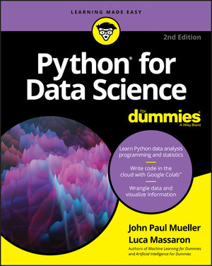

# Python for Data Science for Dummies - Code Repository

## Introduction

This repository contains the Python 2.7 code examples from the book "Python for Data Science for Dummies." The goal of this project is to update and maintain these code examples for Python 3, ensuring compatibility and enhancing their usability for current data science practices.

### Companion Website

For additional resources and the original code downloads, visit the [companion website](https://www.wiley.com/en-us/Python+for+Data+Science+For+Dummies,+2nd+Edition-p-9781119547662#downloads-section).

## Table of Contents

- **Part 1: Getting Started with Data Science and Python**
  - Chapter 1: Discovering the Match between Data Science and Python
  - Chapter 2: Introducing Python’s Capabilities and Wonders
  - Chapter 3: Setting Up Python for Data Science
  - Chapter 4: Working with Google Colab

- **Part 2: Getting Your Hands Dirty with Data**
  - Chapter 5: Understanding the Tools
  - Chapter 6: Working with Real Data
  - Chapter 7: Conditioning Your Data
  - Chapter 8: Shaping Data
  - Chapter 9: Putting What You Know in Action

- **Part 3: Visualizing Information**
  - Chapter 10: Getting a Crash Course in MatPlotLib
  - Chapter 11: Visualizing the Data

- **Part 4: Wrangling Data**
  - Chapter 12: Stretching Python’s Capabilities
  - Chapter 13: Exploring Data Analysis
  - Chapter 14: Reducing Dimensionality
  - Chapter 15: Clustering
  - Chapter 16: Detecting Outliers in Data

- **Part 5: Learning from Data**
  - Chapter 17: Exploring Four Simple and Effective Algorithms
  - Chapter 18: Performing Cross-Validation, Selection, and Optimization
  - Chapter 19: Increasing Complexity with Linear and Nonlinear Tricks
  - Chapter 20: Understanding the Power of the Many

- **Part 6: The Part of Tens**
  - Chapter 21: Ten Essential Data Resources
  - Chapter 22: Ten Data Challenges You Should Take

## Contributing

Contributions to this repository are welcome, especially in the form of updating code for Python 3 compatibility and improving documentation. Please feel free to fork this repository, make your changes, and submit a pull request.

## Contact

daryl.allen.jr@gmail.com

